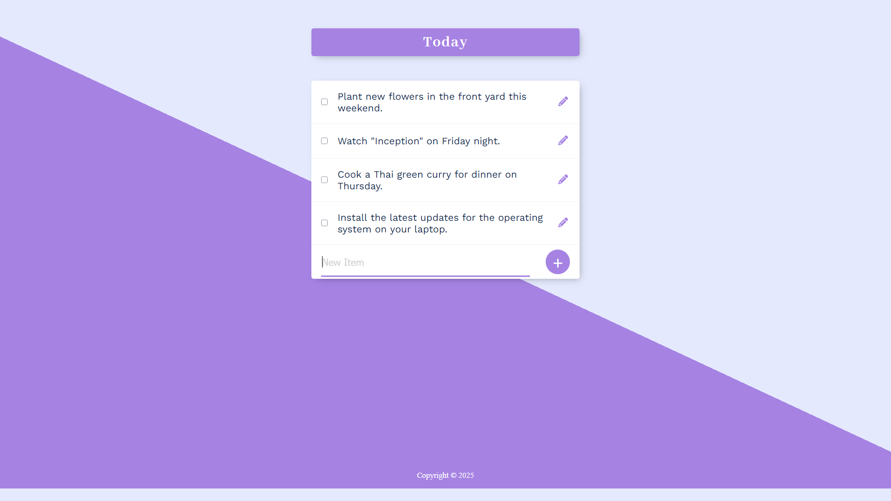

# Permalist Project

## Table of Contents
- [Permalist Project](#permalist-project)
  - [Table of Contents](#table-of-contents)
  - [Project Overview](#project-overview)
  - [Screenshot](#screenshot)
  - [Features](#features)
  - [Technologies Used](#technologies-used)
  - [Installation](#installation)
  - [Usage](#usage)
  - [Configuration](#configuration)
  - [Database Setup](#database-setup)
  - [API Endpoints](#api-endpoints)
  - [Contact](#contact)

## Project Overview

Permalist is a simple web application that allows users to create and manage a persistent to-do list. It uses Node.js, Express, EJS for templating, and PostgreSQL for data storage.

## Screenshot



## Features

*   **Add Items:** Users can add new items to the to-do list.
*   **Edit Items:** Users can edit existing items in the list.
*   **Delete Items:** Users can delete items from the list.
*   **Persistent Storage:** Items are stored in a PostgreSQL database, ensuring they persist across sessions.
*   **Interactive UI:** Uses HTML, CSS, and JavaScript to provide a dynamic user experience.

## Technologies Used

*   Node.js
*   Express
*   EJS
*   PostgreSQL
*   HTML
*   CSS
*   JavaScript

## Installation

1.  **Clone the repository:**

    ```sh
    git clone <repository_url>
    cd <project_directory>
    ```

2.  **Install dependencies:**

    ```sh
    npm install
    ```

## Usage

1.  **Configuration:**

    Create a `.env` file in the root directory with the following variables:

    ```env
    DB_USER=your_db_user
    DB_HOST=localhost
    DB_DATABASE=your_db_name
    DB_PASSWORD=your_db_password
    DB_PORT=5432
    ```

    Replace the values with your PostgreSQL database credentials.

2.  **Database Setup:**

    *   Ensure PostgreSQL is installed and running.
    *   Create a database with the name specified in the `.env` file (e.g., `your_db_name`).
    *   Run the SQL queries from `queries.sql` to create the necessary tables (`items`).

3.  **Start the server:**

    ```sh
    npm start
    ```

    Open your browser and navigate to `http://localhost:3000`.

## Configuration

The application uses environment variables for database configuration. Ensure that the `.env` file is correctly set up with your PostgreSQL credentials.

## Database Setup

1.  **Create the `items` table:**

    ```sql
    CREATE TABLE items (
        id SERIAL PRIMARY KEY,
        title VARCHAR(100) NOT NULL
    );
    ```

## API Endpoints

*   **GET /**: Displays the to-do list.
*   **POST /add**: Adds a new item to the list.
*   **POST /edit**: Edits an existing item in the list.
*   **POST /delete**: Deletes an item from the list.

## Contact

*   **Rajiv Kumar**
*   **Email:** kumarrajiv0920@gmail.com
*   **GitHub:** [My GitHub Profile](https://github.com/Rajiv-0920)
*   **Linkedin:** [Connect with me on LinkedIn](www.linkedin.com/in/rajivkumar0920)
